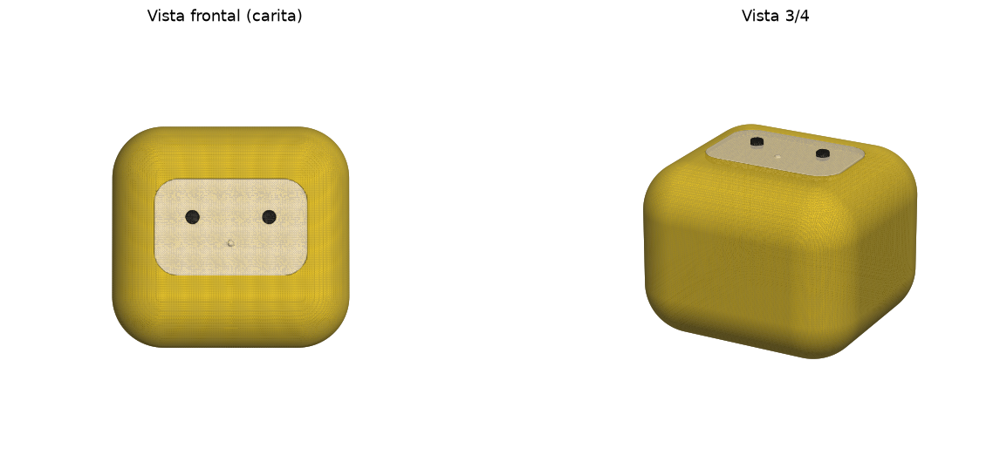

# Personaje Cubo 3D — multicolor 🟨⬜⚫

Personaje 3D tipo **cubo redondeado** con carita, inspirado en la foto de referencia,
**sin las paticas**. Multicolor como el referente: **cuerpo amarillo, panel de la cara
crema, y ojos + nariz negros en relieve**.



## Archivos

### Piezas para imprimir (una por color, ya registradas en la misma posición)
| Archivo | Color | Qué es |
|---|---|---|
| `cuerpo_amarillo.stl` | amarillo | el cubo, con el rebaje donde encaja la cara |
| `cara_crema.stl` | crema | el panel de la carita **+ la naricita**, queda **al ras** del cuerpo |
| `ojos_negro.stl` | negro | los dos ojos, **en relieve** (sobresalen) |

### Modelo a color (para ver / compartir, NO para imprimir directo)
| Archivo | Qué es |
|---|---|
| `cubo_personaje.glb` | modelo a color (ábrelo en cualquier visor 3D) |
| `cubo_personaje.3mf` | proyecto multicolor con las 3 piezas y colores |
| `preview.png` | render de referencia |

Las 3 piezas encajan como un rompecabezas (no se solapan) y comparten el mismo
sistema de coordenadas, así que al cargarlas juntas caen exactamente en su lugar.

## Especificaciones

- **Dimensiones:** 60 × 56 × 47 mm (más delgado; el relieve de los ojos añade ~1 mm al fondo)
- **Panel crema:** 38 × 24 mm (rectangular), grosor 1.8 mm, embutido al ras
- **Ojos:** Ø 3.4 mm, negros, relieve de 1.2 mm
- **Nariz:** Ø 1.4 mm, crema (mismo color de la cara), relieve suave de 0.5 mm
- Las 3 piezas son mallas **cerradas (watertight)**.

## Cómo imprimirlo a color

### Opción A — Impresora multimaterial (Bambu con AMS, Prusa MMU, etc.)
1. Abre **`cubo_personaje.3mf`** en tu slicer (trae las 3 piezas y los colores), **o**
   importa los 3 STL juntos: al preguntar *"¿cargar como un solo objeto?"* di **sí**.
2. Asigna un filamento a cada pieza: amarillo al cuerpo, crema a la cara (con la naricita) y negro a los ojos.
3. Orientación recomendada: **acostado sobre la cara trasera** (la carita mirando hacia
   arriba). Así los cambios de color quedan por capas limpias y los ojos salen
   hacia arriba **sin necesidad de soportes**.

### Opción B — Impresora de un solo color (cambio manual de filamento)
1. Carga el `.3mf` o los 3 STL como un solo objeto.
2. Usa la función *"cambio de filamento por altura/pausa"* (o *Color Change*) de tu
   slicer para cambiar de amarillo → crema → negro según sube la impresión.
3. Misma orientación: carita hacia arriba.

### Opción C — Piezas por separado y ensamblar
Imprime cada STL con su filamento y pégalas (encajan por diseño). Útil si no tienes
multimaterial y no quieres pausas.

### Ajustes sugeridos (punto de partida)
- Altura de capa: **0.2 mm** (0.12–0.16 mm para más detalle)
- Relleno: 10–15 % · Paredes: 3 · Soportes: **no** (en la orientación recomendada)
- Adherencia: *brim* opcional

## Personalizarlo

Todos los parámetros (en mm) están al inicio de `generar_cubo.py`:

- `W`, `H`, `D`, `R` → tamaño y redondeo del cubo
- `FACE_W`, `FACE_H`, `FACE_R`, `FACE_CY`, `PANEL_T` → panel de la cara
- `RELIEF`, `EMBED` → cuánto sobresalen / se hunden los ojos
- `EYE_DX`, `EYE_DY`, `EYE_R` → posición y tamaño de los ojos
- `NOSE_DY`, `NOSE_R`, `NOSE_RELIEF` → posición, tamaño y relieve de la naricita
- `COL_*` → colores de la previsualización
- `VOXEL` → resolución de la malla (menor = más detalle, más lento)

Regenerar:

```bash
pip install numpy scikit-image trimesh matplotlib lxml
python3 generar_cubo.py   # genera los STL + glb + 3mf
python3 preview.py        # (opcional) regenera preview.png
```

## Cómo está hecho

Se define cada color como un **campo de distancia con signo (SDF)** y se combinan con
operaciones booleanas: el cuerpo es un cubo redondeado con un rebaje; el panel rellena
ese rebaje, con la naricita crema, menos los huecos de los ojos; y los ojos son
cilindros negros que sobresalen en relieve. Cada pieza se convierte en malla con **marching cubes**,
quedando cerrada y lista para imprimir.
